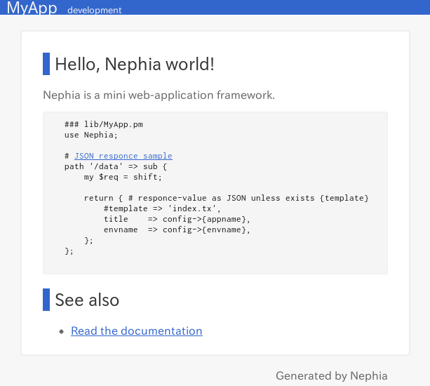

Nephia入門(1)では, Nephiaのインストールとひな形生成について解説します.

# Nephiaのインストール

```
$ cpanm Nephia
```

cpanmコマンドでCPANからインストールします.
2013年6月19日現在のNephiaの最新版は0.14です.

## 開発版の入手

Nephiaは, 開発リーダーのytnobodyさんを中心に, [Yancha](http://yancha.hachiojipm.org/)に集うHachioji.pmのメンバーによって日々進化しています.
Nephiaの開発版を試してみたい場合, GitHubからcloneした上でインストールしましょう.
NephiaはMinillaで開発されていますので, リポジトリをcloneしてから`minil install`で導入することができます.

```
$ git clone https://github.com/ytnobody/Nephia.git
$ cd Nephia
$ minil install
```

なお, 後で説明するNephiaのひな形生成用コマンドの`nephia-setup`から, 現在導入済みのNephiaのバージョンを確認することができます.

```
$ nephia-setup --version
Nephia 0.14
```

Nephiaはまだまだ開発途上なので, バージョンアップに伴って, 様々な仕様変更が行われる可能性があります.
疑問点であったり, バグと思われる動作を発見した場合, このコマンドでバージョンを確認した上で[Yancha](http://yancha.hachiojipm.org/)に報告すれば, Nephiaの開発スタッフが対応してくれるでしょう.

# ひな形の生成

Nephia入門(1)では, Nephiaのひな形を作ってから, plackupして動作確認する... という所までをやりたいと思います.

Nephiaのインストールが済んでいれば, `nephia-setup`というコマンドが使えるようになります.
Nephiaのひな形は, このコマンドから生成することができます.

ひな形を生成したいディレクトリで`nephia-setup MyApp`と打ち込むと,

```
$ nephia-setup MyApp
create path MyApp
create path MyApp/lib
create path MyApp/etc
create path MyApp/etc/conf
create path MyApp/view
create path MyApp/root
create path MyApp/root/static
create path MyApp/t
spew into file MyApp/app.psgi
spew into file MyApp/lib/MyApp.pm
spew into file MyApp/view/index.html
spew into file MyApp/root/static/style.css
spew into file MyApp/cpanfile
spew into file MyApp/t/001_basic.t
spew into file MyApp/etc/conf/common.pl
spew into file MyApp/etc/conf/development.pl
spew into file MyApp/etc/conf/staging.pl
spew into file MyApp/etc/conf/production.pl
spew into file MyApp/.gitignore
```

このように, 自動的にNephiaのひな形を生成してくれます.

## 追加Flavor

`nephia-setup`コマンドで生成されるひな形は, Flavorを指定することで変更することができます.

```
$ nephia-setup MyApp --flavor=Flavor::Name
```

デフォルトで入っているFlavorのDefaultは, テンプレートエンジンとしてText::MicroTemplateを採用しています.
他にテンプレートエンジンとしてTemplate.pm, Text::Xslateを利用するFlavorが用意されています.

Template.pmを利用する場合,

```
$ cpanm Nephia::View::TT
$ nephia-setup MyApp --flavor=View::TT
```

同様に, Text::Xslateを利用する場合,

```
$ cpanm Nephia::View::Xslate
$ nephia-setup MyApp --flavor=View::Xslate
```

で, それぞれひな形を生成することができます.

Flavorについては, mackee_wさんが開発した｢Nephia::Lite｣用のFlavorもあります.

また, Amon2のように, デフォルトでTwitter BootstrapとjQueryが入っているといいなあ... という方向けに, [Nephia::Setup::Bootstrap](https://github.com/papix/Nephia-Setup-Bootstrap)を書きました.
このモジュールはまだCPANにアップしていないので, GitHubからcloneしてインストールする必要がありますが, このモジュールを導入すると,

```
$ nephia-setup MyApp --flavor=Bootstrap
```

で, Twitter BootstrapとjQueryが準備されたひな形を生成することができます.
但し, Nephia::Setup::BootstrapはText::MicroTemplateにしか対応していないので, Nephia::View::TTやNephia::View::XSと併用することはできません.

# モジュールのインストール

Nephiaを実行する上で必要なモジュールをインストールしましょう.

```
$ cd MyApp
$ cpanm --installdeps .
```

生成したひな形が配置されているディレクトリ(先ほどの例の場合, `MyApp`ディレクトリ)に移動して, `cpanm --installdeps .`で, cpanfileから必要なモジュールをインストールできます.

Cartonを使っている場合,

```
$ cd MyApp
$ carton install
```

でOKですね.
これで準備ができたので, plackupコマンドで実行してみましょう.

# plakcupで起動

Nephiaで書かれたウェブサービスの起動は, とても簡単です.

```
$ plackup app.psgi
HTTP::Server::PSGI: Accepting connections at http://0:5000/
```

`plackup`コマンドに対して, ディレクトリ内にある`app.psgi`を引数に与えて実行すると, localhost:5000でウェブサービスが立ち上がります.

ブラウザを起動して, `localhost:5000`にアクセスすると...



このように, ひな形生成時に用意されたページが出てくるはずです!

# 次回予告

次回の｢Nephia入門 (2)｣では, Nephiaを使った簡単な占いウェブサービスを作りながら, Nephiaの仕組みと使い方を学んで行きます.

