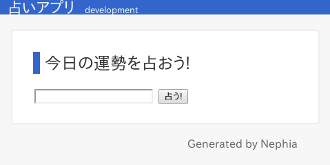
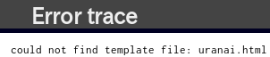
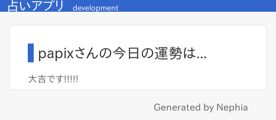
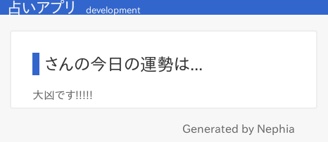

Nephia入門講座, 第3回目です.
前回は, ｢占いアプリ｣に必要な機能を, `lib/Uranai.pm`に実装していきました.
今回は, `index.html`と`uranai.html`という2つのテンプレートを用意して, ｢占いアプリ｣をひとまず完成させましょう.

# テンプレート

テンプレートは, `view`ディレクトリの中に格納されています.
初期状態では`index.html`というテンプレートが用意されているので, まずはこれを｢占いアプリ｣向けに編集します.

```html
? my $c = shift;
<html>
<head>
  <link rel="stylesheet" href="/static/style.css" />
  <link rel="shortcut icon" href="/static/favicon.ico" />
  <title><?= $c->{title} ?> - powerd by Nephia</title>
</head>
<body>
  <div class="title">
    <span class="title-label"><?= $c->{title} ?></span>
    <span class="envname"><?= $c->{envname} ?></span>
  </div>

  <div class="content">
    <h2>今日の運勢を占おう!</h2>
    <form action="/uranai">
        <input type="text" name="name">
        <input type="submit" value="占う!">
    </form>
  </div>

  <address class="generated-by">Generated by Nephia</address>
</body>
</html>
```

こんな感じです.
ごくシンプルに, 名前を入力するテキストフォームと, ｢占う!｣と表示された送信ボタンを配置しています.
送信ボタンがクリックされた場合, `/uranai`に対してGETメソッドでアクセスを行います.

この状態で`plackup`コマンドでアプリを立ちあげてしてブラウザで確認すると, 次のように表示されるはずです.



うまくフォームが表示されていますね!

# エラーが起きたら...

では, この状態でテキストフォームに適当な値を入れて, ｢占う!｣ボタンを押すとどうなるでしょうか.
`/uranai`の実装は`lib/Uranai.pm`に書いてありますが, まだ`uranai.html`のテンプレートが用意できていませんね.



｢テンプレートファイル`uranai.html`が見つかりません!｣というエラーが表示されます.

このように, `development`環境(plackupに`-E`オプションを与えない)だと, このようにエラーのトレースが表示されます.
一方, `production`環境(plackupに`-E production`というオプションを指定)だと,


このように, 最小限のエラーだけが表示されます(ちなみに, plackupを動かしているコンソールに出力されるログも, `-E`オプションによって変化します).

`development`環境で出るエラートレースはデバッグに有用ですが, サーバー上でこのような情報が出てしまうと, 脆弱性を発見される情報源になりかねませんので, 気をつけましょう.

# uranai.htmlの作成

それでは, `view/uranai.html`を作って行きましょう.

```html
? my $c = shift;
<html>
<head>
  <link rel="stylesheet" href="/static/style.css" />
  <link rel="shortcut icon" href="/static/favicon.ico" />
  <title><?= $c->{title} ?> - powerd by Nephia</title>
</head>
<body>
  <div class="title">
    <span class="title-label"><?= $c->{title} ?></span>
    <span class="envname"><?= $c->{envname} ?></span>
  </div>

  <div class="content">
    <h2><?= $c->{name} ?>さんの今日の運勢は...</h2>
      <?= $c->{result} ?>です!!!!!
  </div>

  <address class="generated-by">Generated by Nephia</address>
</body>
</html>
```

こんな感じです.

前回, `lib/Uranai.pm`に実装した`/uranai`ページへアクセスした際の処理において, 最後はこのようになっていました.

```perl
    return {
        template => 'uranai.html',
        name     => $req->param('name'),
        result   => $result,
        title    => config->{appname},
        envname  => config->{envname},
    };
```

実はこのハッシュが, テンプレートの1行目にある`? my $c = shift;`によって, `$c`に格納されています.
その為, テンプレートの中で`<?= $c->{name} ?>`や`<?= $c->{result} ?>`といった形で利用できるのです.

# テンプレートの記法

さて, ここで改めて, テンプレートの中で使える記法について説明しておきます.

Nephiaがデフォルトで利用するテンプレートエンジン, Text::MicroTemplateでは, テンプレート中の行の先頭に`?`を付けると, その行はPerlのコードとして処理されます.
また, `<?= $i ?>`このように書くと, 生成するHTMLの中に, `$i`という変数の中身を埋め込むことができます.

これさえ覚えておけば, 後はPerlで色々と細かい処理をすることができます.
例えば,

```perl
  <div class="content">
? for my $i (1..10) {
    <?= $i ?>
? }
  </div>
```

このように書けば, `<?= $i ?>`の部分は`$i`が1から10の間まで繰り返し実行されるので,

```html
  <div class="content">
    1
    2
    3
    4
    5
    6
    7
    8
    9
    10
  </div>
```

テンプレートからはこのようなHTMLが生成され,


このように表示されます.

# 動作確認

さあ, テンプレートの実装も終わりました.
`plackup`コマンドで起動して, 動作を確認してみましょう!

`localhost:5000`にアクセスして, テキストボックスに適当な名前を入力し, `占う!`ボタンをクリックすると...



出来ましたね! このように, 占いの結果が表示されます.
これでひとまず, 占いアプリは完成です.

# リダイレクト

もちろん, 占いアプリはこれで完璧, とは言えません.
例えば, テキストボックスに何も入力しない状態で`占う!`ボタンをクリックしてみると...



このように表示されてしまいます.

いろいろな対策方法がありますが, 今回はシンプルに, ｢テキストボックスが空だったら, `/uranai`から`/index`にリダイレクトさせる｣という方針を取ります.
というわけで, `lib/Uranai.pm`のうち, `/uranai`にアクセスした際に処理される部分を, 次のように書き換えます.

```perl
path '/uranai' => sub {
    my $req = shift;

    my @results = qw/ 大凶 凶 吉 小吉 中吉 大吉 /;
    my $result = $results[int rand(@results)];

    my $name = $req->param('name');

    if ($name eq '') { # ... (1)
        return res { redirect('/'); }
    }

    return {
        template => 'uranai.html',
        name     => $req->param('name'),
        result   => $result,
        title    => config->{appname},
        envname  => config->{envname},
    };
};
```

テキストフォームに文字列が入っていない場合, `$req->param('name')`のような形でアクセスすると, undefではなく空文字('')が返ります.
その為, (1)の部分で, テキストフォームから受け取ったデータが空文字かどうかをチェックしています.

```perl
        return res { redirect('/'); }
```

この部分が, 実際にリダイレクトを指示している部分です.
`redirect('/')`で, `/`にリダイレクトすることを示し, これを`res`に与えることで, `/uranai`から`/`にリダイレクトすることができます.

実際に動かしてみると, テキストボックスに文字列が入っていた場合`/uranai`に遷移して結果を表示し, 何も入力しなかった場合はそのまま`/`に戻ってくることが確認できるはずです.

さて, resの中には, 他にも`body`や`content_type`, `content_encoding`などを入れることができます.
例えば,

```perl
    return res {
        content_type('text/plain');
        content_encoding('utf-8');
        body('foobar');
    }
```

こんな感じにすると,


このようなテキストを表示させることができます.

# 改造改造, また改造!

今回作った占いアプリは, まだまだ改造の余地があります. 例えば...

- テキストボックスが空欄だった場合, `/`にリダイレクトした上で｢テキストボックスが空欄です!｣と表示させる
- アクセスするごとに占いの結果が変わるので, その日の間は同じ結果を表示するようにする(結果をキャッシュする)
- twitterと連携して, 占い結果をツイートできるようにする

...などです.

# 次回予告

次回の｢Nephia入門 (4)｣では, テンプレートの機能を使って複雑なデータをテーブルで表示する練習をしてみたいと思います.

